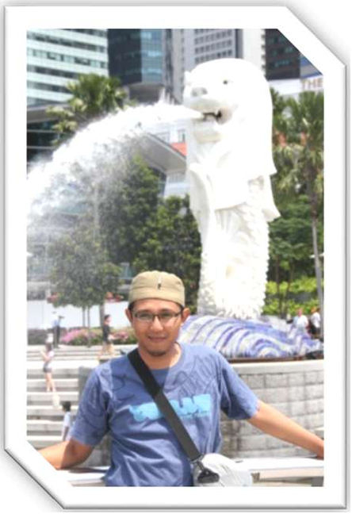

# CuricculumVitae

<h3 align="center">My Github Profesional Profile</h3>

<!-- Komentar Anda -->

   

###

  
   
  

<!-- Link belum selesai -->

  

<h1 align="center">Hai Semua</h1>

  

<!-- Visitor -->

<h3 align="left">👩‍💻  About Me</h3>

Hi there... I'm MOKO from Indonesia   My Name Hendratmoko please call me MOKO WhatsApp number +628813924881 Email: h_moko@yahoo.com Place: Bantul Yogyakarta Indonesia  I was born in Bantul and studied at UGM (1995), UNY (1996), UNTIRTA (2010), before completing my studies at Harvard University (2021). I have experience working with the Indonesia Ministry of Education and Culture and than the Cilegon City Education Department. Now, I teach Software Engineering at Vocation School in Sanden Yogyakarta

EXPERIENCE
  Quality Standart ISO 9001:2000/IWA 2 treatments to Schools.  
Quality Digitaly tratments to Schools and Agencys etc. 
ISO 9001:2000 ISO 9001:2008 Transition Training  
ISO 9001:2008 Series Lead Auditor (IRCA A17054) 
BNSP Auditors Standart 

EMPLOYMENT SUMMARY 
  1 Juli 2000 To 1 Juli 2003  SMU Muhammadiyah 2 Depok 
21 Juli 2003 to To 21 Sept 2003 SMK YP Fatahillah 1  
2006 To 2007 International School of SMU N 2 Krakatau Steel 
01 Jan 2004 to 01 Jan 2018 SMK N 1 Cilegon 
01 Jan 2018 until now SMK N 1 Sanden 

FORMAL PRODUCT SKILL
  ISO 9001:2008 Series Lead Auditor (IRCA A17054)  
ISO 9001:2000 ISO 9001:2008 Transition Training 
Assembling & Legal Action ISO 9001:2008/IWA2 Consult  
Quality Standart ISO 9001:2000/IWA 2 treatments to SMK Negeri 1 Cilegon  
Quality Standart ISO 9001:2000/IWA 2 treatments to SMK YP 17 Cilegon  
Quality Standart ISO 9001:2000/IWA 2 treatments to SMK YP Fatahillah Cilegon  
Quality Standart ISO 9001:2000/IWA 2 treatments to SMK  Yabhinka Cilegon  
Quality Standart ISO 9001:2000/IWA 2 treatments to SMK YP Krakatau Steel Cilegon  
Quality Standart ISO 9001:2000/IWA 2 treatments to SMK Ikhlas Multi Program Serang  
Quality Standart ISO 9001:2000/IWA 2 treatments to SMP Negeri 2 Cilegon  
Quality Digitaly tratments to SMA N 2 Cilegon  
Quality Digitaly tratments to BAPPEDA Cilegon   
BNSP Standart  treatments to SMK N 1 Sanden  
etc.  

### 💫 About Me on another place:

### 🌐 My Socials Media:

### ✍️ Quote

#### 💻 Tech Language and tools Expert:
 
 
 
 
 
 
 
 
 
 
 
 
 
 
 
 
 
 
 
 
 
 
 
 
 
 
 
 
 
 
 
 
 
 
 
 
 
 
 
 
 
 
 
 
 
 
 
 
 
 
 
 
 
 
 
 
 
 
 
 
 
 
 
 
 
 
 
 
 
 
 

 
 

---

###

###

<picture>
  <source media="(prefers-color-scheme: dark)" srcset="https://raw.githubusercontent.com/hendratmoko/hendratmoko/output/pacman-contribution-graph-dark.svg">
  <source media="(prefers-color-scheme: light)" srcset="https://raw.githubusercontent.com/hendratmoko/hendratmoko/output/pacman-contribution-graph.svg">
  
</picture>

###

  💰 You can help me by Donating:
   
  
    
    

  

<h5 align="center">
  For further information & assistances, please do not hesitate to contact me at email, fb or my mobile phone number. 
This is my Curriculum Vitae, to be used properly
</h5>

  
<!-- Proudly created with 
GPRM ( https://gprm.itsvg.in ) 
Static Badge https://shields.io/badges
https://forthebadge.com/generator
Profil  https://profile-readme-generator.com/

-->
